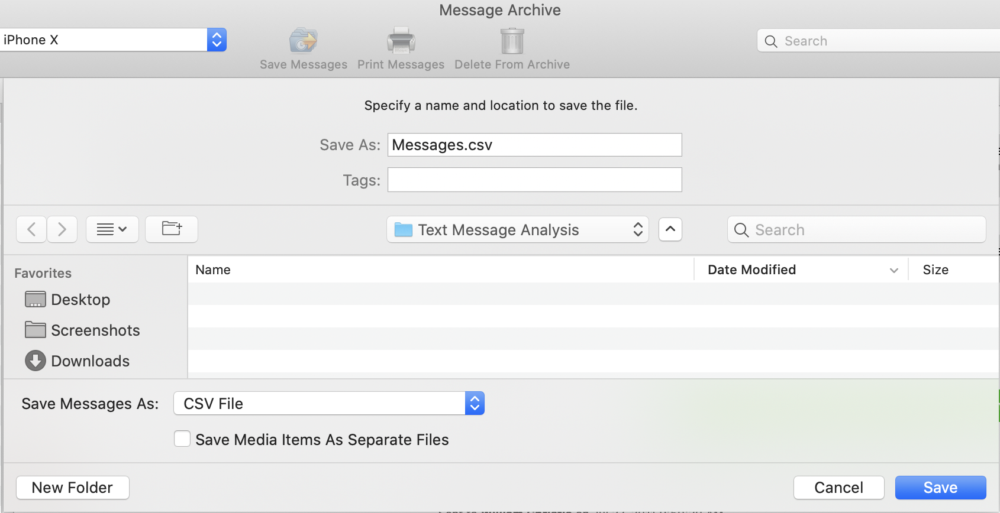

# Exporting text messages with PhoneView


# Recommended Format

Open PhoneView, wait until it has archived the iPhone. Once that is done, go
to *Archives* > *View Message Archives*, and then click *Save Messages*.
When you export, pick the CSV export format, and uncheck the export of media
(unless you want every photo and video sent in the messages to be exported
as well):



## CSV file format

```csv
"direction","timestamp","name","number","content","type"
Received,"Jul 23, 2011 6:12:54 AM",+33681818181,+33681818181,"Contents of message received",SMS
Sent,"Jul 23, 2011 6:15:54 AM",Jérémie Lumbroso,+33655665566,"Contents of message sent",iMessage
```

Note that we have added the header for clarity, but it will not be contained in the
output as produced directly from PhoneView. Also:
- The first column, `"direction"` contains `Received` or `Sent`;
- The column `"name"` contains the name associated with the number, if the
number is in the phone's Contacts; otherwise it is just the number itself.
- The column `"type"` is one of: `SMS`, `WhatsApp`, `iMessage`.

# Manual Excerpt on Message Mode

As collected on August 13th, 2020 from [Ecamm Software's official PhoneView
user manual](http://downloads.ecamm.com/PhoneView.pdf):

> ## Messages Mode
> 
> To access the device’s iMessages, SMS messages, and WhatsApp messages, choose
> Messages from the left-hand sidebar.
>
> PhoneView will save your messages each time the iPhone is connected and
> PhoneView is opened. Message mode shows all conversations currently stored on
> the iPhone. If corresponding phone numbers and contact images are present in your
> iOS or Mac Contacts app, the appropriate names and photos will be displayed.
>
> Received handwriting is not shown for iMessages.
>
> ### Copying Messages From the iPhone to Your Computer:
>
> #### Method 1:
> Double-click one or more messages. The info will automatically be copied to a folder
> in your Documents folder as a PDF file or text file and displayed. Any selected media
> items will also be copied and opened. You can specify the format of exported
> messages in the PhoneView settings. (See PhoneView Settings section below.)
>
> #### Method 2:
> Highlight the message or message groups to be copied. To select a range of
> messages, click the first message, and then hold down the shift key on your keyboard
> while clicking the last message. Once the desired messages or message groups have
> been selected, click the "Copy From iPhone" button on the toolbar. You will see a file
> chooser showing a location on your computer. Select a destination location for the 
> messages, choose formatting options, and click the "Save" button. The selected
> messages and media items will be copied into the selected folder on your Mac.
>
> #### Method 3:
> Drag messages or message groups directly from the PhoneView browser into a
> Finder window or onto the Desktop. The selected messages and media items will be
> copied to the destination. You can specify the format of exported messages in the
> PhoneView settings. (See PhoneView Settings section below.)
>
> ### Message Archive Access:
> Messages are archived each time an iOS device is connected to PhoneView. To
> access the archived data, click the "Archives" button in the PhoneView toolbar or
> choose Message Archive from the PhoneView menu.
>
> ### Message iTunes Backup Access:
> If you back up your iOS device to your Mac using iTunes, PhoneView will allow you to
> view and archive messages from the iTunes backup. To access the backed up data,
> click the "iTunes Backups" button in the PhoneView toolbar or choose View Message
> iTunes Backup from the PhoneView menu. Note that this feature will not if you back
> up to iCloud instead of your Mac.
